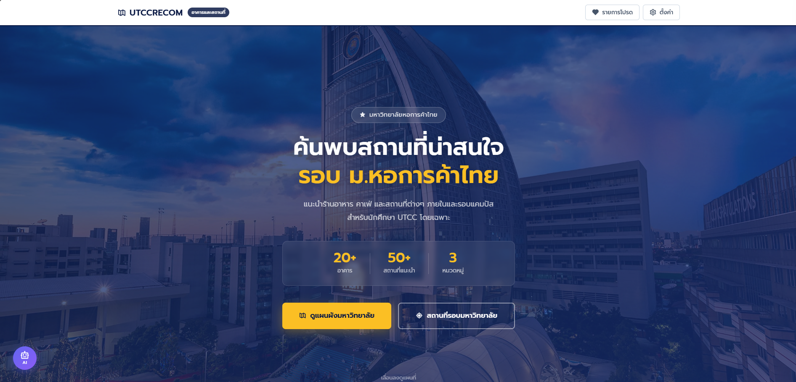
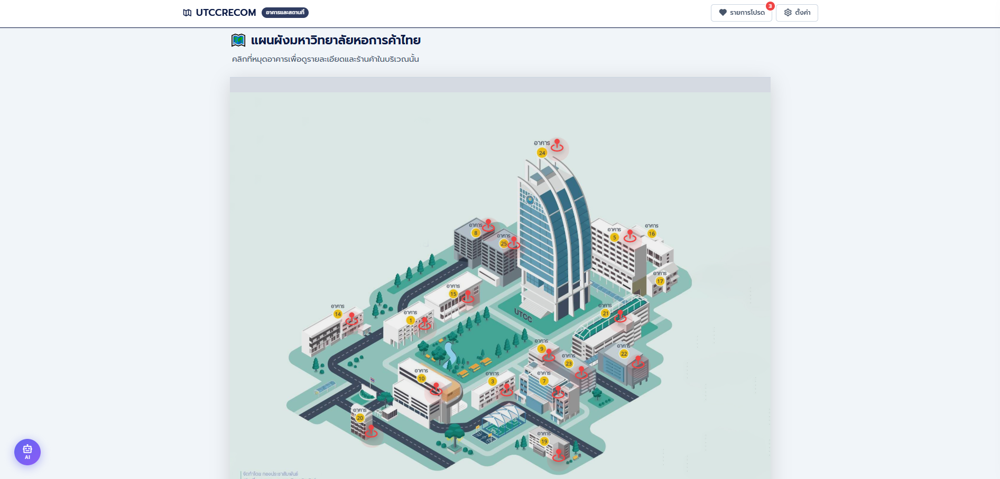
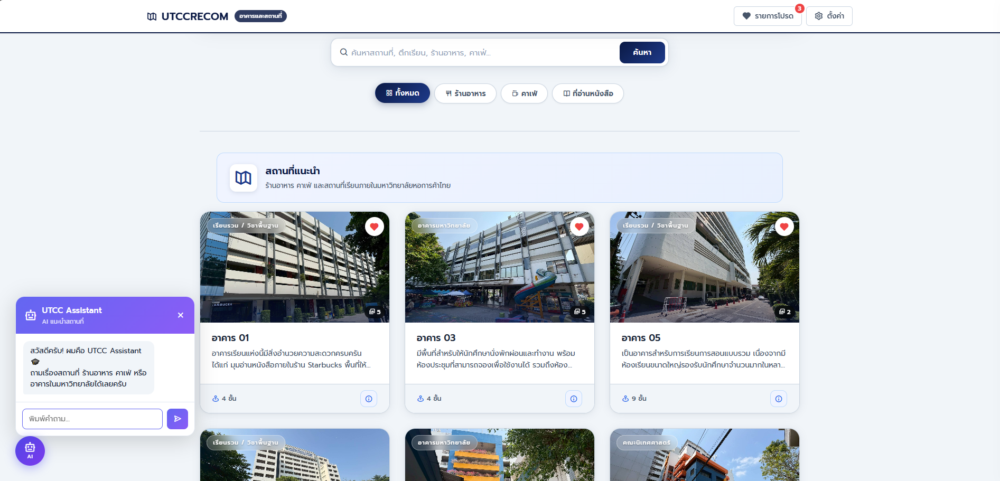
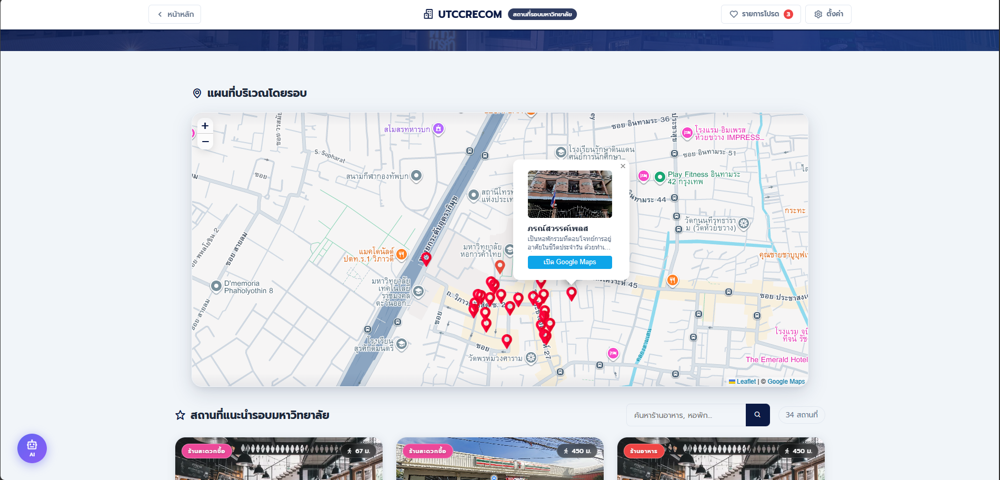
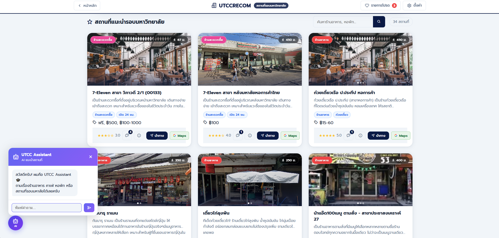
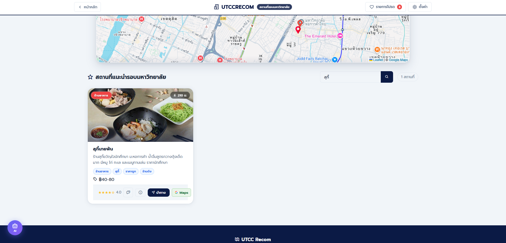
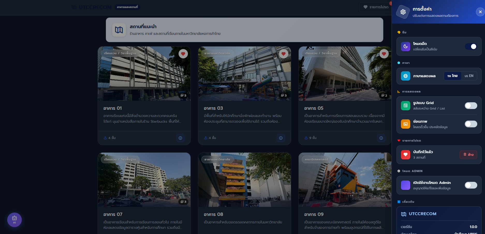

UTCC Recommendation Website

เว็บไซต์แนะนำอาคาร สถานที่ภายในมหาวิทยาลัย และสถานที่รอบมหาวิทยาลัยหอการค้าไทย พัฒนาด้วย Java Spring Boot และหน้าเว็บ HTML/CSS/JavaScript โดยข้อมูลหลักเชื่อมต่อกับ PostgreSQL/Supabase

Features

- ค้นหาและกรองสถานที่ตามหมวดหมู่
- แสดงอาคารและสถานที่ภายในมหาวิทยาลัย
- แสดงร้านอาหาร คาเฟ่ หอพัก และบริการรอบมหาวิทยาลัยบนแผนที่
- เพิ่ม แก้ไข และลบข้อมูลสถานที่
- รีวิวและให้คะแนนสถานที่
- AI chatbot และ AI สรุปรีวิว
- รองรับภาษาไทย/อังกฤษ, Dark Mode และการตั้งค่าการแสดงผล

## Demo

### หน้าหลัก



### แผนผังและสถานที่ภายในมหาวิทยาลัย

<p align="center">
  
  
</p>

### สถานที่รอบมหาวิทยาลัย

<p align="center">
  
  
</p>

### การค้นหาและการตั้งค่า

<p align="center">
  
  
</p>

หน้าตั้งค่าสามารถเปลี่ยนภาษา รูปแบบการแสดงผล และเปิด Dark Mode ได้ ดูตัวอย่างเพิ่มเติมที่ [Demo](./Demo/)

โดยใช้ Technology

- Java 17 และ Spring Boot 3.2
- Spring Data JPA
- PostgreSQL / Supabase
- HTML, CSS และ JavaScript
- Maven

Software Testing

มีชุดงาน QA ระดับเริ่มต้นจากการตรวจและทดสอบระบบจริง ด้วย Manual Test Cases, API Testing, Bug Reports, Regression Checklist และ Test Summary

ผลการทดสอบจะระบุ `PASS`, `FAIL`, `BLOCKED` และ `NOT RUN` 

รายละเอียด [QA Documentation](./qa/README.md)

Running the Project

โปรเจกต์ต้องมี environment variables สำหรับ Supabase, PostgreSQL และ Gemini API ก่อนเริ่มระบบ

```powershell
.\mvnw.cmd spring-boot:run
```

 `http://localhost:8080`
